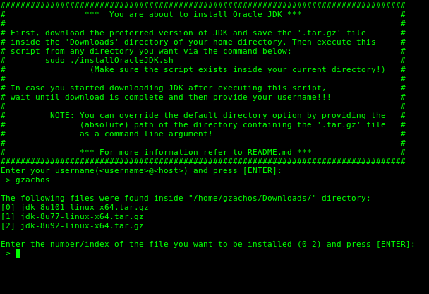

oraclejdk-debian-installer
============

A Bourne Shell script that will install Oracle® JDK (see notes below), after you download it from
[oracle.com](http://www.oracle.com/technetwork/indexes/downloads/index.html#java).

Operating System
----
LINUX // Debian-based distributions<br>
(Developed on Linux Mint 18 Sarah)

Shell
-----
- Bourne shell (sh)

Developer
-----
George Z. Zachos

License
-----
[GNU GENERAL PUBLIC LICENSE // Version 2, June 1991](LICENSE)

Notes
-----
- This script was developed in order to cover personal needs and it is by no mean
guaranteed to work properly on every system.
- This script does __not__ currently support installation of __Oracle® JDK 9__!

Execution
-----
There are two ways that you can execute this script.

 * __1st way__:
```Shell
sudo ./installOracleJDK
```
In order to use this way, you have to download the '_.tar.gz_' file of
your choice from _oracle.com_ and save it inside the __Downloads__ directory of
your account. After download is complete, run the above command. During execution
you will be asked to enter your _username_ (username@host), in order for the
script to enter /home/_username_/Downloads/ and search for the file to be installed.

 * __2nd way__:
```Shell
sudo ./installOracleJDK <absolute-path-of-directory>
```
This way allows you to provide the __absolute__ path of the directory containing
the '_.tar.gz_' file as a command line argument, in order to override the default
option. __Note that the absolute path should end with a forward slash__ ( __/__ ).
<br><br>

Command example:
```Shell
sudo ./installEOracleJDK /home/gzachos/Desktop/
```

In case more than one '_.tar.gz_' files exist inside the specified directory,
you will be prompted just like it is shown in the screenshot below, to choose
the one you want to be installed.<br><br>

e.g.<br>

